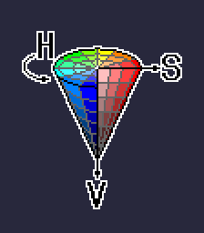

# Color

[`< Overview`](./README.md)

This article is meant to (1) provide an overview of the digital color theory concepts that one should understand in order to best use *Stipple Effect*, and (2) explain and illustrate some of *Stipple Effect*'s color-related jargon and conventions.

## Color models
[*Wikipedia article*](https://en.wikipedia.org/wiki/Color_model)

A **color model** is a mathematical model used to represent colors as a combination of numbers. Each of these numbers is associated with a particular attribute or quantity.

### RGB(A)
[*Wikipedia article*](https://en.wikipedia.org/wiki/RGBA_color_model)

The **RGB** color model is an additive color model with the components **red** (R), **green** (G), and **blue** (B). These components are referred to as color channels.

In *Stipple Effect*, as with most digital RGB implementations, each of these channels is allocated 8 bits, and thus has a value ranging from 0 to 255.

The RGB color model is best visualized as a cube, where each axis corresponds to one of the red, green and blue color channels. The vertex where the cube is black signifies R, G, and B values of 0, while the vertex where the cube is white signifies maximal R, G, and B values of 255 each. The greyscale gradient from black to white runs between these vertices through the middle of the cube.

The **RGBA** color model is an extension of RGB that adds a fourth channel: alpha, or opacity. The alpha channel determines how opaque the base color determined by the RGB channels is on top of whatever it may be superimposed upon. This quality is called "opacity" by convention instead of "transparency" because opacity increases as the alpha channel value increases, i.e. an alpha value of 255 is fully opaque, while an alpha value of 0 is fully transparent.

**Hex codes**

[*Wikipedia article*](https://en.wikipedia.org/wiki/Web_colors#Hex_triplet)

**Hex codes** are six- or eight-digit alphanumeric codes following a leading `#` that represent digital colors in the RGB color model. Since the maximum value an RGB color channel can have is 255, a base-16 numbering system is the numbering system with the lowest [radix](https://en.wikipedia.org/wiki/Radix) that can represent all possible RGB channel values in two digits.

Hexadecimal (base-16) numbering uses the digits 0 to F, where A follows 9. Thus, the digit A = 10, B = 11, and so on. Alphabetical digits can be represented in uppercase or lowercase.

255 is represented in hexadecimal as **FF**:

`FF = F0 + F = (15 * 16) + 15 = 255`

Every 2-digit segment in a hex code corresponds to the value of a color channel. The first two digits correspond to red, digits 3 and 4 to green, and digits 5 and 6 to blue. If present, digits 7 and 8 correspond to the alpha/opacity channel.

From the above example:

*fb0d0d*
* **Red:** fb16 = 251
* **Green and Blue:** 0d16 = 13

*40caa1*
* **Red:** 4016 = 64
* **Green:** ca16 = 202
* **Blue:** a116 = 161

**Read more:**
* [Hexadecimal (base-16) numbers](https://en.wikipedia.org/wiki/Hexadecimal)

### HSV

The HSV model as implemented in *Stipple Effect* is best visualized as a cone. It is also often described as a cylinder. [**Hue**](https://en.wikipedia.org/wiki/Hue) is the angular property. [**Saturation**](https://en.wikipedia.org/wiki/Colorfulness) the radial dimension. That is to say that the saturation of a particular color in the model can be described as the ratio of its distance from the center of the cone to the radius of the cone at that particular height level. [**Value**](https://en.wikipedia.org/wiki/Lightness), alternatively **lightness** or **brightness**, is the height level of the color in the cone.

Value is somewhat ambiguously defined in HS(V/L/B) color models. *Stipple Effect* defines value as the normalized single highest RGB color channel value. Thus, pure white ([`#ffffff`](https://en.wikipedia.org/wiki/White)) and pure blue ([`#0000ff`](https://en.wikipedia.org/wiki/Blue)) have the same value (1.0), despite white being a lighter color than blue.

Any color can be mapped from the RGB model to the HSV model, and vice versa. *Stipple Effect* has various [color samplers](./interface.md#samplers) that can be swapped out to visualize colors using different models.

## [System colors](./interface.md#system-colors)

### Combination modes

Some of *Stipple Effect*'s editing [tools](./tools.md) allow for the mixing of the primary and secondary color in a few ways:

* **Dither mode:** Edited pixels are allocated to either the primary or secondary color based on 4x4 ordered dithering
* **Blend mode:** The blended color is the result of a linear interpolation of the primary and secondary color
* **Noise mode:** Each painted pixel's color is the result of a linear interpolation of the primary and secondary color with a random `t` value [**[see here]**](../api/graphics.md#lerp_color)

The degree to which the combination mode favours either the primary or the secondary color can be adjusted with the **combination mode bias** slider in the [tool options bar](./interface.md#tool-options).

