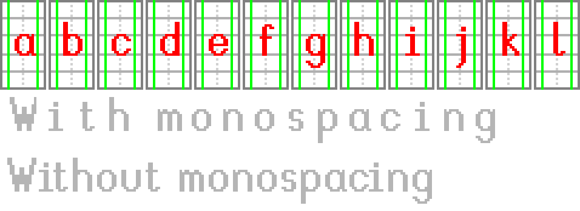
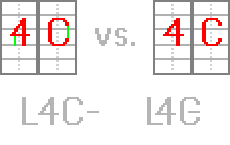

[`< Overview`](./README.md)

# Fonts

*Stipple Effect* uses the underlying [*Delta Time*](https://github.com/jbunke/delta-time) library to load and display fonts. Thus, the program's native system fonts, as well as user-defined fonts uploaded for use by the [text tool](./text-tool.md) at runtime, must comply with Delta Time's **font standard**.

## Font files

### Format

*Stipple Effect* font files must have the following dimensions:

* **Width:** multiple of 319px
* **Height:** multiple of 303px

### Parsed pixel colors

* **Red** (`#ff0000`) - parsed as part of the [glyph](https://en.wikipedia.org/wiki/Glyph) associated with its bounding box
* **Green** (`#00ff00`) - parsed as left- or right pixel boundary of the glyph associated with its bounding box *at that particular pixel height*

**Read more:**
* [Color hex codes](https://en.wikipedia.org/wiki/Web_colors#Hex_triplet)

### Boundary enforcement

Explicitly defining boundaries using the color green can a few applications, including:

* defining [monospaced](https://en.wikipedia.org/wiki/Monospaced_font) fonts

* enforcing spacing for sequences of characters that would otherwise overlap or interlock

## Character sets

Fonts support following **character sets**:

* [ASCII](https://en.wikipedia.org/wiki/ASCII#Printable_character_table)

* Latin Extended

Future updates will aim to extend the characters supported by fonts, which will eventually mean additional character sets.

The ASCII character set is must be provided by user-defined fonts. Additional character sets are optional.

## Uploading fonts

Fonts can be uploaded while using the [text tool](./text-tool.md) with <kbd>Shift</kbd> + <kbd>T</kbd>, or by clicking on  in the [tool options bar](./interface.md#tool-options).
