# The Interface

[`< Overview`](README.md)

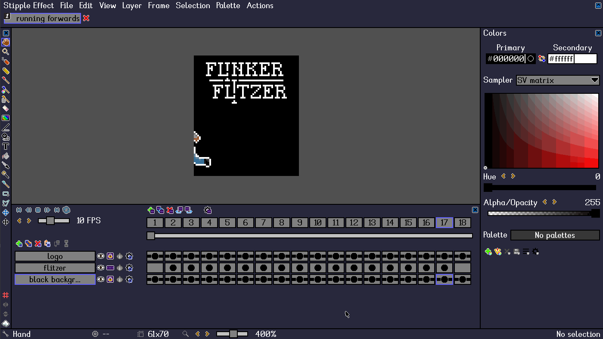

The program interface consists of a viewport called the "workspace" surrounded by a series of panels. Any of these panels can be hidden according to the preferences of the user or the demands of the task at hand.

### Sections

* [Navigation bar](#navigation-bar)
* [Projects](#projects)
* [Workspace](#workspace)
* [Toolbar](#toolbar)
* [Flipbook](#flipbook)
* [Colors](#colors)
* [Bottom bar](#bottom-bar)

## Navigation bar

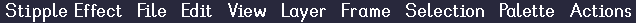

Most program actions can be accessed via the navigation bar. Actions with keyboard shortcuts display the shortcut next to the action description in the navigation dropdown.

## Projects

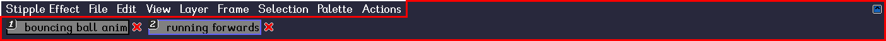

The Projects panel displays the projects that are currently open in the program. Projects 1 through 9 can be selected with the matching hotkey (<kbd>1</kbd> - <kbd>9</kbd>).

## Workspace

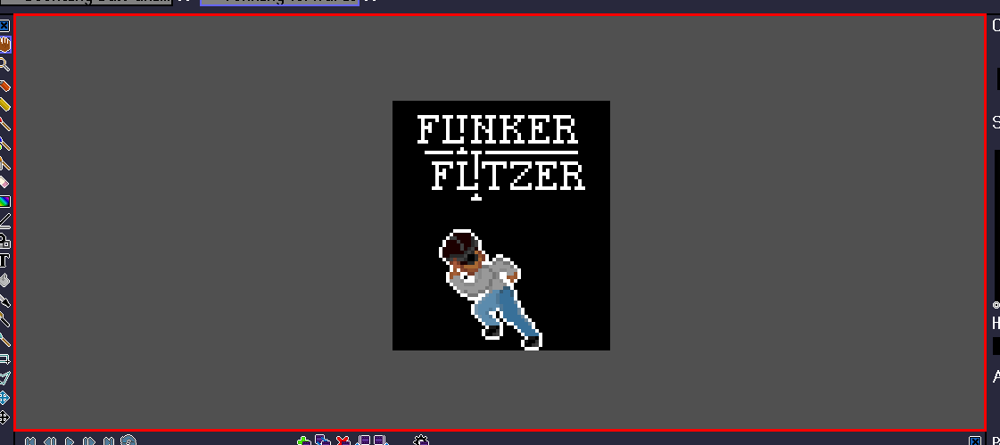

The workspace displays the contents of the active cel (the active layer at the current frame index). It is the main editing viewport in *Stipple Effect*.

## Toolbar

### Tools

The upper section of the toolbar displays the program's editing [tools](./tools.md). The currently selected tool is indicated by a square surrounding the tool icon.

### Additional

The lower section of the toolbar houses the pixel grid toggle, the reflection options, and the outline configuration.

The pixel grid icon may be greyed out if the workspace zoom level is too small to display the pixel grid at its current configured size.

The reflection actions require a selection; the icons will be greyed out if no pixels are selected.

### Tool options

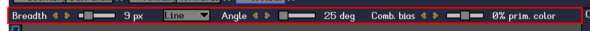

Most tools have properties that can be modified to alter their behaviour called "tool options". The tool options appear in a horizontal bar above the workspace.

## Flipbook

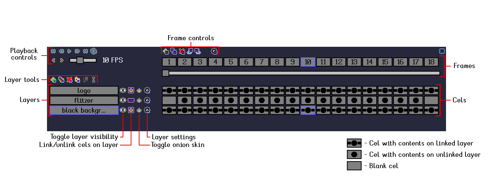

The flipbook is the primary project organization panel. Projects in *Stipple Effect* consist of layers and frames; the flipbook is designed to display these in the most coherent way possible.

### Layers

The [layers](./layer.md) of the current project are displayed along the left side of the flipbook panel. Layers are sorted according to their render order: layers at the bottom are rendered first and the layers above them are rendered afterwards, on top of the layers below them. Layer buttons can be dragged and resorted. Alternatively, layers can be resorted with the "Move layer down" and "Move layer up" buttons.

Next to the layer buttons are several icons1:

* **toggle layer visibility**
* **link/unlink cels on layer**
* toggle onion skin
* layer settings2

1 - **Bold** listings indicate icons whose actions constitute an edit.

2 - Opening the layer settings does not constitute an edit, but modifying a layer property like its name or how it renders onion skins does.

### Frames

The [frames](./frame.md) of the current project are displayed along the top of the flipbook panel. Like layers, frame buttons can be dragged and resorted. A frame with a custom [duration](./frame-duration.md) will have an asterisk (\*) following the frame number.

### Playback

The playback controls are:

* to first frame 
* previous frame 
* play  / stop 
* next frame 
* to last frame 

There are several playback modes that can be cycled through:

* play forwards 
* play backwards 
* loop 
* ping-pong  (changes directions when it reaches the beginning or end of the animation)

Users can also set the playback speed, ranging from 1 frame per second to 24 FPS.

### Cels

A [cel](./cel.md) is the juncture of a layer and a frame. A project that consists of three layers and 12 frames will have 36 (3 x 12) cels.

A cel can be selected by clicking it. A two-dimensional range of cels (array) can be selected by <kbd>Shift</kbd> + clicking a target cel. The range will span from the currently selected cel to the target cel.

Cels have different icons depending on their contents:

* An empty cel (cel with no pixel data) has no icon
* A cel with pixel data on a linked layer ()
* A cel with pixel data on an unlinked layer ()

## Colors

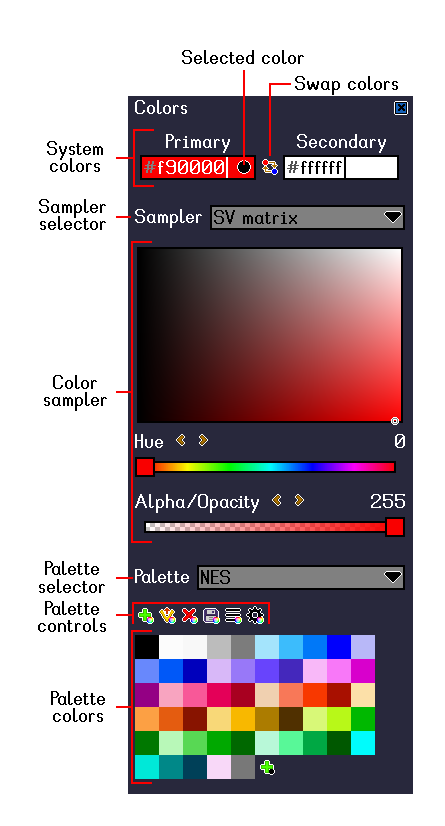

### System colors

*Stipple Effect* uses two customizable **system [colors](./color.md)**. For most [tools](./tools.md) that use or set the system colors, left-clicking is associated with the **primary color**, while right-clicking is associated with the **secondary color**. The colors allocated to primary and secondary can be swapped.

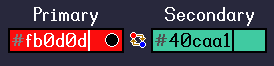

Either the primary or secondary color slot is **selected** at any given time. The slot that is selected is indicated by a black dot to the right of the slot's color hex code. The selected slot color is the color that is displayed by the color sampler. Adjusting the slider, matrix or wheel values of the sampler will adjust the color in the selected slot. The selected slot can be changed by clicking on either the primary or secondary color textbox.

### Samplers

A color sampler is a particular way of representing the RGB color space. The program supports various color samplers:

_**RGB Sliders**_

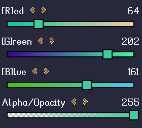

_**HSV Sliders**_

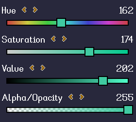

_**Color Wheel**_

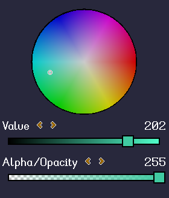

The color wheel represents hue and saturation. **Hue** represented by the angle of the selection around the wheel, while **saturation** is the distance of the selection from the center of the wheel.

**Value** is represented as a separate slider.

_**SV Matrix**_

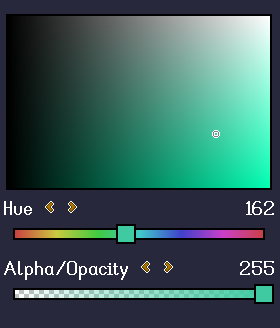

The SV matrix displays a two-dimensional gradient of **saturation** and **value**. This can be used to easily visualize the range of intensities and brightnesses of a particular hue.

**Hue** is represented as a separate slider.

_**Normal Map**_

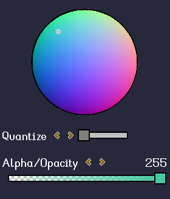

Normal mapping is a technique most often used to simulate lighting. A "normal map" is a type of asset that is used in conjuction with a standard texture to represent the **surface normals** of the object represented by the texture. These surface normals can then be used to simulate lighting based on a light source.

The normal map sampler in *Stipple Effect* can be [quantized](https://en.wikipedia.org/wiki/Color_quantization) for a limited set of directions or faces, which may be more pertinent to a pixel art context.

Read more about normal maps [here](https://en.wikipedia.org/wiki/Normal_mapping).

### Palettes

Pixel art often uses a restricted [color palette](./palette.md). *Stipple Effect* lets users easily create, edit, save, import, and delete palettes.

Users can click the plus icon with the black dot, representing the selected color, to add the selected system color (primary or secondary) to the current palette.

Users can drag and drop palette colors to resort them. Left-clicking a palette color will assign it to the primary color slot, while right-clicking will assign it to the secondary color slot. <kbd>Shift</kbd> + clicking a palette color will toggle its inclusion status, and <kbd>Ctrl</kbd> + clicking a palette color will remove it from the palette.

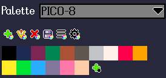

## Bottom bar

The bottom bar is almost purely informational. It displays:

* the currently selected tool
* the target pixel (i.e. the canvas pixel that the mouse is aiming at)
* the canvas size (pixel width by pixel height)
* the zoom level
* selection information (number of pixels selected, selection bounding box coordinates + dimensions)

The only interactive elements in the bottom bar are the zoom slider and incrementation buttons.
