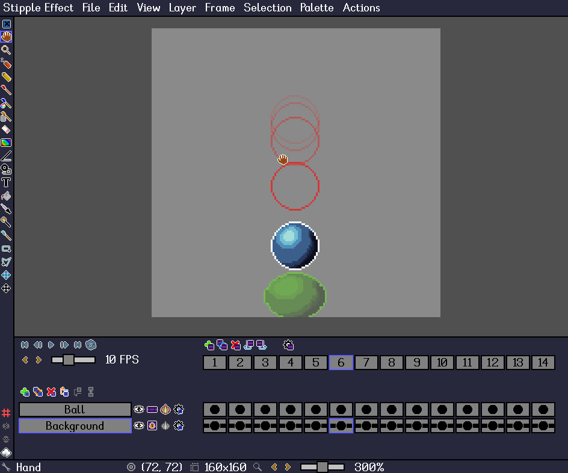

[`< Projects`](./project.md)

# Layer

**Layers** are stacked on top of one another and rendered in order to compose the [project](./project.md).

Layers are *Stipple Effect* projects' vertical organizational axis. Conversely, [frames](./frame.md) make up the horizontal axis. The intersection of a particular layer and a particular frame is called a [cel](./cel.md).

By default, a layer's cels are **unlinked**. This means that each cel on the layer is independent. When a layer is **linked**, all its cels share their image content, and any changes made to any cel on the layer are propagated to all other cels. This is useful for static layers like backgrounds.

A project's layers are displayed in the [flipbook panel](./interface.md#flipbook).

## Onion skin

**Onion skins** are animation aids that can be activated on unlinked layers. They show projections of the layer's contents on preceding or successive cels. Onions skins can be displayed up to six cels in advance or behind the current frame index.

There are three types of onion skins:
* outline - an outline of the cel's non-transparent pixels tinted in a particular hue
* simple - a translucent projection
* tinted - a translucent projection tinted with a particular hue

Onion skins can be rendered under or above the current cel's contents. Users can also configure the stepwise dropoff in opacity between the current cel and onion skins.

## Layer actions

###  Add new layer

[*API function*](../api/project.md#add_layer)

**Shortcut:** <kbd>Ctrl</kbd> + <kbd>L</kbd>

Adds a new layer to the project directly above the current editing layer. The new layer becomes the new editing layer.

###  Duplicate layer

[*API function*](../api/project.md#duplicate_layer)

**Shortcut:** <kbd>Ctrl</kbd> + <kbd>Shift</kbd> + <kbd>L</kbd>

Duplicates the current editing layer of project and places the duplicate directly on top of the original layer. The newly created duplicate layer becomes the new editing layer.

###  Remove layer

[*API function*](../api/project.md#remove_layer)

**Shortcut:** <kbd>Ctrl</kbd> + <kbd>Shift</kbd> + <kbd>Backspace</kbd>

Removes the current editing layer of the project. If the layer to be removed is the bottommost layer, the editing layer becomes the new bottommost layer after the removal. Otherwise, the new editing layer becomes the layer below the layer that was removed.

###  Move layer up

[*API function*](../api/project.md#move_layer_up)

**Shortcut:** <kbd>Ctrl</kbd> + <kbd>Shift</kbd> + *Up Arrow Key*

Swaps the current editing layer of the project with the layer above it.

###  Move layer down

[*API function*](../api/project.md#move_layer_down)

**Shortcut:** <kbd>Ctrl</kbd> + <kbd>Shift</kbd> + *Down Arrow Key*

Swaps the current editing layer of the project with the layer below it.

###  Merge with layer below

[*API function*](../api/project.md#merge_with_below)

**Shortcut:** <kbd>Ctrl</kbd> + <kbd>Shift</kbd> + <kbd>M</kbd>

Merges the current editing layer of the project with the layer below it. The merged layer inherits the settings (name, opacity, etc.) of the lower of the layers that were merged.

###  Flatten project

[*API function*](../api/project.md#flatten)

**Shortcut:** <kbd>Ctrl</kbd> + <kbd>M</kbd>

Flattens the project, compressing all of its contents down to a single layer.

###  Disable layer /  Enable layer

*API functions - [disable layer](../api/layer.md#disable), [enable layer](../api/layer.md#enable)*

**Shortcut:** <kbd>Shift</kbd> + <kbd>1</kbd>

**Disable:**

Makes the layer invisible.

**Enable:**

Makes the layer visible.

###  Isolate layer

**Shortcut:** <kbd>Shift</kbd> + <kbd>2</kbd>

Enables the current editing layer and disables all other layers of the project. This way, the current editing layer will be the only layer in the project that is visible.

This can also be achieved by <kbd>Shift</kbd>-clicking a layer's visibility icon (/).

###  Enable all layers

**Shortcut:** <kbd>Shift</kbd> + <kbd>3</kbd>

Makes all layers visible.

###  Link cels /  Unlink cels

*API functions - [link cels](../api/layer.md#link_cels), [unlink cels](../api/layer.md#unlink_cels)*

**Shortcut:** <kbd>Ctrl</kbd> + <kbd>Q</kbd>

**Link cels:**

Links the cels of the layer together. This means that *all of the layer's cels in will display the same image*, and that changes made on any of the layer's cels will be propagated to all other cels. The linked content will be set from the cel at the current frame index.

**Unlink cels:**

Unlinks the cels of the layer. If the layer was previously linked, all its cel will still initially appear to be the same, but can now be modified independently.

###  Toggle onion skin

**Shortcut:** <kbd>Ctrl</kbd> + <kbd>1</kbd>

Toggles the layer's onion skins on or off.

**Note:**

Layers will linked cels cannot display onion skins, as such layers do not vary from frame to frame.

###  Layer settings menu

**Shortcut:** <kbd>Shift</kbd> + <kbd>L</kbd>

Opens the layer settings menu. This menu allows users to configure a layer's **name**, **opacity**, and **onion skin**.

---

**SEE ALSO**

* [Layer shortcuts](./shortcuts.md#layers)
* [Scope](./scope.md)
* [Cel](./cel.md)
* [Frame](./frame.md)
* [The interface](./interface.md)
