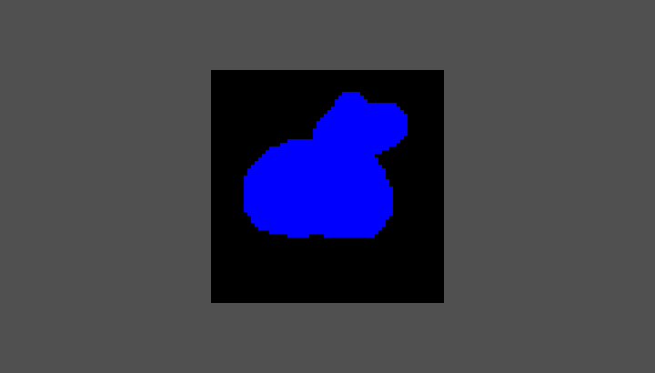
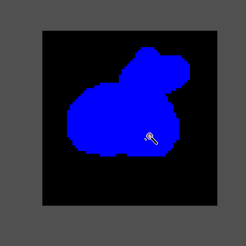
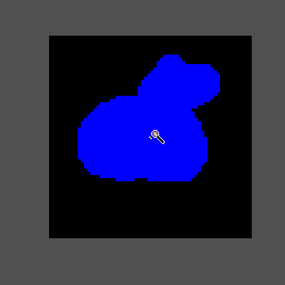
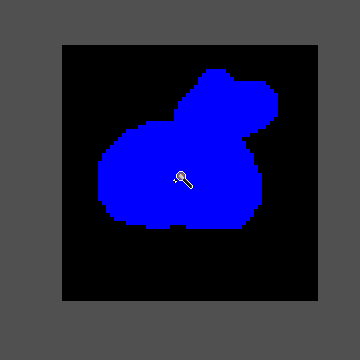

[`< Overview`](./README.md)

# Outlining

**Outlining** in *Stipple Effect* works differently than it does in most similar art programs. Rather than filling the outline of a layer or a selection, the various outline actions in *Stipple Effect* simply propagate the [pixel selection](./selection.md) to its own outline based on a certain **outline configuration**, also called a **side mask**.

##  Outline configuration menu

**Shortcut:** <kbd>Shift</kbd> + <kbd>O</kbd>

Users can configure the side mask in the outline configuration menu. The UI has a textbox for each side and corner that accepts values ranging from -10 to 10.

* a negative value `-X` represents an inner outline of X pixels along that side/corner
* a positive value `X` represents an outer outline of X pixels along that side/corner
* a value of 0 represents no outline along that side/corner

The outline configuration is updated whenever a textbox is updated, but an outline can only be applied if the current project has a pixel selection.

## Outline actions

It could become somewhat tedious to open the outline configuration menu every time you wanted to apply an outline. Due to this, *Stipple Effect* has three shortcuts for outlines.

### Single outline

[*API function*](../api/global.md#single_outline)

**Shortcut:** <kbd>Shift</kbd> + <kbd>9</kbd>

A **single outline** is a special outline case defined as an outer outline of 1 pixel along the top, left, right, and bottom. Corner pixels are not outlined.

### Double outline

[*API function*](../api/global.md#double_outline)

**Shortcut:** <kbd>Ctrl</kbd> + <kbd>Shift</kbd> + <kbd>9</kbd>

A **double outline** is a special outline case defined as an outer outline of 1 pixel along every side and corner.

### Outline with existing configuration

**Shortcut:** <kbd>Ctrl</kbd> + <kbd>9</kbd>

Applies an outline with the side mask configured in the outline configuration menu.

---

**SEE ALSO**

* [Selection](./selection.md)
* [Outline shortcuts](./shortcuts.md#outline)
