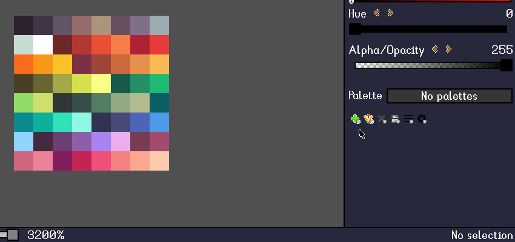

# Color palettes

[`< Overview`](./README.md)

A core component of pixel art is a restricted **color palette**.

In modern digital art, a [24-bit RGB color space](./color.md#rgba) allows us to represent over 16 million unique colors. However, pixel art is a medium of constraints. One of the constraints of traditional pixel art is a highly restrictive color palette comprised from as little as two to a few dozen colors.

*Stipple Effect* supports palettes, and has a few features specifically designed for palettes or with palettes in mind.

UI elements related to palettes can be found in the [Colors panel](./interface.md#palettes).

## Exclusion

Individual colors in *Stipple Effect* can be marked as **excluded**. An excluded palette color has a  overlay. An excluded color, while still a part of the palette, is omitted from palette operations such as [palettization](./color-actions.md#palettization) or the [shade brush](./shade-brush.md) .

## Importing palettes

*Stipple Effect* has a file type specifically for palettes, with the file extension `.stippal`. Such palette files can be opened and loaded directly with .

However, users may want to import palettes in other formats from the Internet or other art programs into *Stipple Effect*. In order to do this:

1. open or paste an uncompressed image (e.g. PNG) of the palette's colors in *Stipple Effect*
2. create a new palette ()
3. extract the canvas colors to the newly created palette ()

---

**SEE ALSO**

* [Palettization](./color-actions.md/#palettization)
* [Extract canvas colors to a palette](./color-actions.md/#extract-canvas-colors-to-palette)
* [Color](./color.md)
* [The interface](./interface.md)
