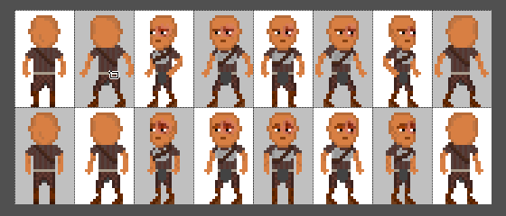
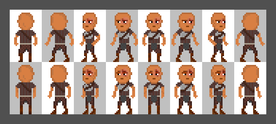

[`< Overview`](./README.md)

# Pixel grid and checkerboard

The **pixel grid** and **checkerboard** are visual aides that are central to many workflows in *Stipple Effect*.

Pixel grid lines can vary in length per dimension from 1 pixel to 128 pixels, while checkerboard squares/rectangles can range from 1 pixel to 256 pixels high and wide.

## Pixel grid

Despite its lines not necessarily criss-crossing every pixel, the **pixel grid** is so named because it is primarily used to measure pixel distances.

The pixel grid also enhances the functionality of the [Box Select](./sel-area-tools.md#box-select)  tool. Holding <kbd>Shift</kbd> while using the tool with the pixel grid enabled () will snap the selection to the grid:

## Checkerboard

The checkerboard's main uses are to visualize transparency or to separate sprites (or other units of work) in a sprite sheet.

The checkerboard dimensions act as the default frame dimensions when the [split sprite sheet to frames](./sizing.md#split-a-sprite-sheet-into-frames)  dialog menu is opened.

## Actions

###  Toggle pixel grid on/off

**Shortcut:** <kbd>Ctrl</kbd> + <kbd>G</kbd>

Toggle the pixel grid on or off. The pixel grid icon is located in the lower segment of the [toolbar](./interface.md#toolbar).

**Note:**

1. It may be impossible to turn the pixel grid on based on the combination of the [workspace](./interface.md#workspace)'s zoom level and the pixel grid's dimensions. If this is the case, the pixel grid icon will be **greyed out**.
2. *Stipple Effect* sometimes crashes when attempting to display the pixel grid for larger canvases. This will be addressed in a future update.

### Quick set pixel grid and checkerboard dimensions

**Shortcut:** <kbd>Ctrl</kbd> + <kbd>B</kbd>

If the [project](./project.md) has a [selection](./selection.md), the program attempts to set the dimensions of the pixel grid and checkerboard rectangles to the bounds of the smallest [axis-aligned bounding box](https://en.wikipedia.org/wiki/Minimum_bounding_box#Axis-aligned_minimum_bounding_box) that captures all the pixels in the selection. If the project does **not** have a selection, the program attempts to set the dimensions of the rectangles to the dimensions of the project canvas.

**Note:**

1. If you want to unlink the dimensions of the pixel grid and the checkerboard, they can be set individually from the `Visual` submenu of the **program settings** .
2. This operation fails if the dimensions of the selection - or the canvas in the effect of no selection - are greater than the maximum bounds permitted for the pixel grid.

---

**SEE ALSO**

* [Box Select](./sel-area-tools.md#box-select) 
* [Split/stitch frames](./sizing.md#splitstitch-frames)
* [Pixel grid shortcuts](./shortcuts.md#pixel-grid)
