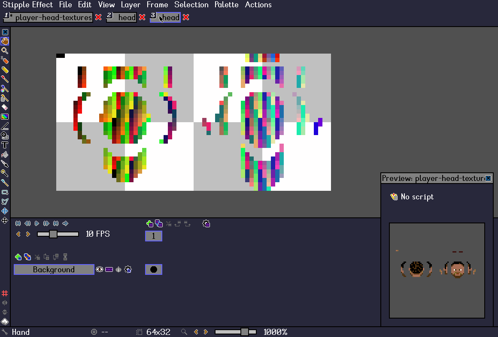

# Preview scripts

[`< Scripting`](scripting.md)

<!-- TODO -->

### Overview
_Stipple Effect_ includes a preview window. The active project can be previewed in an external window outside the editing workspace. By default, the contents in the preview window are just the contents of the project. However, with **preview scripts**, the user can essentially supply an algorithm that modifies the project for the sake of the preview.

The script is executed every time that the user edits the project. An edit to the project might be a brush stroke or a paste action. Advancing the frame index, for example, would not be considered an edit.

The applications of preview scripts are nearly endless, and can range from simple scripts that merely preview a greyscale version of the project, to complex use cases such as this:



The above example is achieved with the following script:

```js
(~ image texture -> image[]) {
    ~ string folder = "C:/Users/Jordan Bunke/Desktop/scripts/swivel/";
    ~ image anim = from(folder + "anim.png");
    ~ image lookup = from(folder + "lookup.png");
    ~ image reskinned = tex_col_repl(anim, lookup, texture);

    ~ int cols = 8; ~ int rows = 2;
    ~ int w = reskinned.w / cols;
    ~ int h = reskinned.h / rows;

    ~ image[] frames = new image[cols * rows];

    for (int y = 0; y < rows; y++)
        for (int x = 0; x < cols; x++)
            frames[x + (cols * y)] = reskinned.section(x * w, y * h, w, h);
    
    return frames;
}
```

These are the images retrieved from their file paths and stored in the variables `anim` and `lookup`:

`anim`:  

`lookup`: 

### Type signatures

Preview scripts can have one of a few possible type signatures.

They must take a single parameter<sup>a, b</sup>. This can either be an `image` or an array of images `image[]`.

They must return either an `image` or an array of images `image[]`. The return type is not correlated with the parameter type.

Thus, the head function of a preview script can take any of the following forms<sup>c</sup>:
1.  ```js
    (image img -> image) { /* contents here... */ }
    ```
2.  ```js
    (image img -> image[]) { /* contents here... */ }
    ```
3.  ```js
    (image[] imgs -> image) { /* contents here... */ }
    ```
4.  ```js
    (image[] imgs -> image[]) { /* contents here... */ }
    ```

<sup>a</sup> - The parameter names `img` and `imgs` are just used as examples.

<sup>b</sup> - The parameter represented by `img`/`imgs` can optionally be declared as immutable by prepending `final` or `~` to the declaration. For example:
```js
(~ image img -> image) { /* contents here... */ }
```

<sup>c</sup> - Preview scripts do not have to have complex function bodies `{ ... }`. For example, the following preview script is valid:
```js
(image[] imgs -> image) -> imgs[0]
```

### More
* [Preview script examples](https://github.com/jbunke/se-script-examples/tree/main/scripts/preview)
