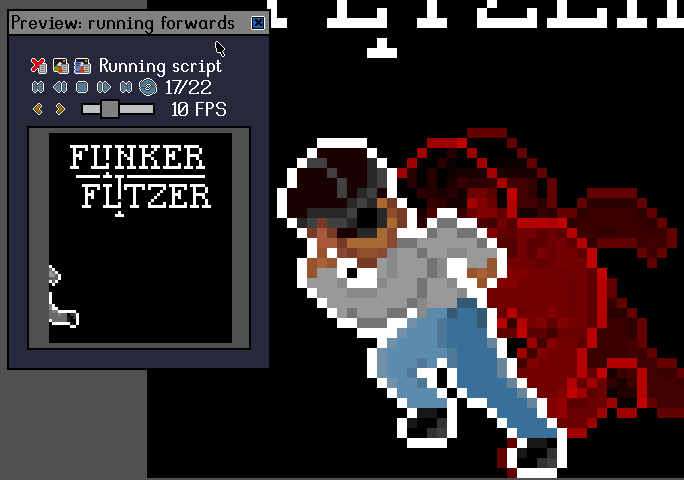
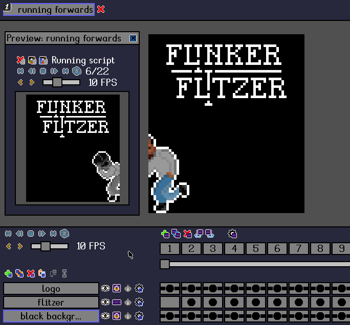

# Preview window

[`< The interface`](./interface.md)

The **preview window** is a secondary viewport that complements the [workspace](./interface.md#workspace). It can be used to view the [project](./project.md) at a different zoom level or to loop an animation while editing a particular [frame](./frame.md) in the workspace.

It can be opened  with <kbd>Shift</kbd> + <kbd>Space</kbd> or with `View > Show preview`.

The contents of the preview window persist across projects. As long as the associated project is still open in *Stipple Effect*, the user can navigate to a different project, and the preview window will still show the same project as long as it remains open. Closing and reopening the preview window will reset it to display the active project.

## Controls

*  pan preview contents -  with the mouse inside the viewport
*  zoom preview contents in or out - *Scroll Mouse Wheel* with the mouse inside the viewport

### Manipulating the window

The preview window is rendered on top of all other UI elements and can be **freely moved** and **resized**. To move it,  on the grey panel at the top of the window. To resize the window,  on the left, right, or bottom edge of the preview window. Hovering over the edge will display a dark blue overlay along the edge and show a drag cursor ( or ).

**Note:**

There is an option in the visual settings to open the preview window in a separate UI window from the main program. However, even with this option turned on, **the preview window will always be embedded in the main program window if the program is maximized**.

### Playback controls

When previewing an animation, the preview window will display the [playback controls](./frame.md#playback-actions). The [playback shortcuts](./shortcuts.md#playback) will target the preview window while the mouse is hovering over it.

## Preview scripts

By default, the preview window merely displays the project as it is. However, with **preview scripts**, the user can define an algorithm that transforms the project's contents for the sake of display in the preview window.

For a technical breakdown of preview scripts, please read their [dedicated page](./preview-scripts.md).

## Converting previews into projects

When a valid preview script has been uploaded and is running in the preview window, additional action buttons will be displayed above the viewport:

###  New project from preview

Converts the output of the preview script into a [project](./project.md). The project will consist of a single [layer](./layer.md) named `From script`.

###  New project from preview with layers preserved

Alternatively, the output of a preview script can be converted into a project **with the layers from the original project preserved**.

Rather than simply populating the image(s) produced by the preview script into the cels of a newly created project on a single layer, this action runs the preview script on the contents of each layer separately, and composes them in the new project in their original layer order.

**Note:**

The resulting project may not match the preview window contents, as the project input is flattened down to a single layer before it is passed to the preview script for preview window display.

---

**SEE ALSO**

* [Preview scripts](./preview-scripts.md)
