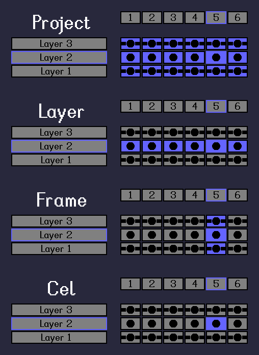

# Scope

[`< Overview`](./README.md)

Algorithmic operations such as [color actions](./color-actions.md) are executed over a user-determined **scope**. This page lists and briefly describes the possible scopes for such operations, as well as the related **options**.

### Scopes

* [**Project:**](./project.md) all cels in the project
* [**Layer:**](./project.md) all cels on the active editing layer
* [**Frame:**](./project.md) all cels of the current frame index
* [**Cel:**](./project.md) the current cel, i.e. the cel of the active editing layer at the current frame index

### Options

* **Include disabled layers?** - an option for scopes that span multiple layers (project, frame) to apply the operation to disabled () layers
* **Ignore selection?** - if the project has a [pixel selection](./selection.md), the operation can either be limited to the selection or applied to the entire canvas

---

**SEE ALSO**

* [Color actions](./color-actions.md)
