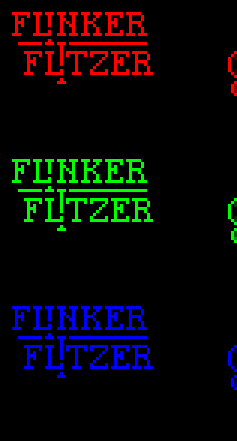
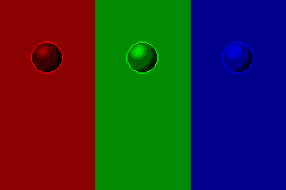

<!-- TODO: Replace DeltaScript links once you have updated Delta Time documentation -->

# Scripting

[`< Home`](/README)

<!-- What? -->

## Scripting basics

Stipple Effect scripts fall into the following categories:

* [Automation scripts](#automation-scripts)
* [Preview scripts](#preview-scripts)
* [Color scripts](#color-scripts)
* [Child scripts](#child-scripts)

### Automation scripts

[Automation scripts](automation-scripts) are scripts that run a series of program actions automatically. For example, a script can be written that reverses the frames in a project. The full list of Stipple Effect program actions that can be executed via script are outlined in the [scripting API](/api/).

Read more about APIs [here](https://en.wikipedia.org/wiki/API).

Type signature for automation scripts: `()` - (no parameters and void return)

### Preview scripts

[Preview scripts](preview-scripts) allow for the transformation of the contents of the preview window. By default, the preview window merely previews the contents of the project as they are. This can already be used in a variety of ways, but it is made exponentially more powerful with scripting.

Valid type signatures for preview scripts:
* `(image -> image)`
* `(image[] -> image)`
* `(image -> image[])` - (only valid for projects with a single frame)

### Color scripts

[Color scripts](color-scripts) transform an input color into an output color. They can be run independently and applied to a certain [scope](scope) of the active project, or they can be used to power the [Script Brush](scripting-brush).

Type signature for color scripts: `(color -> color)`

### Child scripts

[Child scripts](child-scripts) are merely scripts that are run from within another script. Child scripts can have any file signature, but will trigger a runtime error if they are passed arguments that do not match the types of the parameters of their [header function](#script-format).

You may run scripts from within any script, but it is recommended *NOT to run child scripts from within preview or color scripts* for the sake of performance. Also in the interest of performance, it is optimal to declare any child scripts used in a script as `final` (also `~`) `script` variables outside any loops. This way, the child script will only be loaded once per its parent script's execution.

<!-- How? -->

## Getting started

Stipple Effect scripts are written in an extension dialect of [DeltaScript](https://github.com/jbunke/delta-time/wiki/DeltaScript) designed specifically for the program. DeltaScript is a lightweight, skeletal scripting language that I designed to be extended for the easy design of [domain-specific languages](https://en.wikipedia.org/wiki/Domain-specific_language) interpreted to Java. It has a very simple syntax and will feel familiar to anyone with programming experience in languages such as C, C++, C#, Java and JavaScript.

Script files can be written in the text editor of your choosing and use the file extension `.ses`. However, `VS Code` is recommended, as the official syntax highlighting extension for Stipple Effect scripting is only available for VS Code.

### Syntax

Scripts consist of a nameless header function optionally followed by **named helper functions**. The type signature of the script is the type signature of its header function. Functions can optionally accept parameters and return a value of a specified return type, **though neither are required**.

```js
// header function
// * has a single parameter "letters"
// * returns a string
(int letters -> string) {
    string word = "";

    for (int i = 0; i < letters; i++)
        word += random_letter();

    return word;
}

// helper function "random_letter"
// * has no parameters
// * returns a char
random_letter(-> char) {
    ~ int MIN = (int) 'a';
    ~ int MAX_EX = ((int) 'z') + 1;

    // "rand" is a native function defined by DeltaScript
    return (char) rand(MIN, MAX_EX);
}
```

A full breakdown of the syntax and semantics of DeltaScript can be found in the [language specification](https://github.com/jbunke/delta-time/wiki/DeltaScript).

### Example

To get a feel of what DeltaScript looks like, here is an example of a preview script:


When the script above is applied to the project on the left, it produces the preview to the right:

| Input | Output |
| :---: | :----: |
|  |  |
|  |  |

___

**SEE ALSO**

* [API](/api/)
* [Script examples](https://github.com/jbunke/se-script-examples)
* [*DeltaScript for Stipple Effect* - VS Code syntax highlighting extension](https://marketplace.visualstudio.com/items?itemName=jordanbunke.deltascript-for-stipple-effect)
