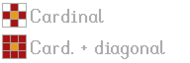
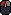
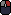
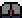

# Selection area tools

[`< Tools`](./tools.md)

## Universal

Selection area tools have **simple**, **additive**, and **subtractive** selection modes:

### Simple selection

Any previous selection is **overridden** and the results of the selection operation comprise the new selection.

### Additive selection (hold <kbd>Ctrl</kbd>)

The pixels captured in the selection operation are **added** to the selection prior to the operation.

Tool cursors will have a `+` symbol next to the reticle to indicate the tool is in additive mode:

 
 
 

### Subtractive selection (hold <kbd>S</kbd>)

The pixels captured in the selection operation are **removed** from the selection prior to the operation.

Tool cursors will have a `-` symbol next to the reticle to indicate the tool is in subtractive mode:

 
 
 

## Brush Select

**Icon:** 

**Hotkey:** <kbd>V</kbd>

### Behaviour

Behaves like the [brush](./brush.md), but for selection.

### Actions

* **Select:** 
* **Increment/decrement brush width:** *Arrow Keys* or <kbd>Shift</kbd> + *Scroll Wheel*

### Modifiers

* <kbd>Ctrl</kbd> - hold to enable **additive mode**
* <kbd>S</kbd> - hold to enable **subtractive mode**

### Tool Options

* **Brush breadth:** 1px - 100px
* **Brush shape:**
  * Circle
  * Square
  * Line
    * **Angle:** slope of the brush

## Wand

**Icon:** 

**Hotkey:** <kbd>W</kbd>

### Behaviour

* performs a search operation that captures pixels based on how similar their color is to the pixel that initiated the operation
* [modifies the selection](#universal) with the pixels captured by the search operation

**Note:**

The wand uses the same search algorithm as the [fill tool](./fill-tool.md).

### Actions

* **Select:** ")
* **Adjust tolerance:** *Arrow Keys* or <kbd>Shift</kbd> + *Scroll Wheel*

### Modifiers

* <kbd>Ctrl</kbd> - hold to enable **additive mode**
* <kbd>S</kbd> - hold to enable **subtractive mode**
* <kbd>Shift</kbd> - hold to enable **global mode**

### Tool Options

* **Tolerance:** determines how similar adjancent colors must be for the fill to spread
* **Search diagonally:** when turned on, diagonal pixels are checked for adjacency in addition to cardinally adjacent pixels.

## Box Select

**Icon:** 

**Hotkey:** <kbd>X</kbd>

### Behaviour

Use the **box select** tool to make rectangular selections. This is a convenient way to quickly enclose a desired selection area.

### Actions

* **Select:** 
* **Move selection:** *Arrow Keys*

### Modifiers

* <kbd>Ctrl</kbd> - hold to enable **additive mode**
* <kbd>S</kbd> - hold to enable **subtractive mode**
* **[while pixel grid is on]** <kbd>Shift</kbd> - hold to snap selection to the [pixel grid](./pixel-grid.md)

## Polygon Select

**Icon:** 

**Hotkey:** <kbd>Y</kbd>

### Behaviour

Define a polygonal selection area by placing vertices. Successive vertices form edges that define the bounds of the selection. Placing a vertex down on the same pixel where the shape began will close the polygon.

### Actions

* **Place vertex:** 
* **Close polygon:** <kbd>Shift</kbd> + 
* **Remove previous vertex:** 
* **Abandon current polygon:** 

### Modifiers

* <kbd>Ctrl</kbd> - hold to enable **additive mode**
* <kbd>S</kbd> - hold to enable **subtractive mode**
