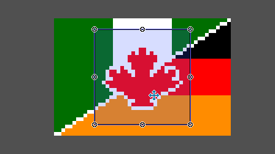

# Selection

[`< Overview`](./README.md)

At any given point, a set of pixels on a [project](./project.md)'s canvas may be selected.

Selections can me determined by [selection area tools](./sel-area-tools.md) and transformed by [selection movement tools](./sel-move-tools.md). Pixels outside the bounds of the canvas can also be selected by certain tools.

## Transformations

Selections can be transformed by area or by contents in the following ways:

* [translation](https://en.wikipedia.org/wiki/Translation_(geometry))
* [stretching](https://en.wikipedia.org/wiki/Scaling_(geometry))
* [rotation](https://en.wikipedia.org/wiki/Rotation_(mathematics))
* [reflection](https://en.wikipedia.org/wiki/Reflection_(mathematics))

## Raising and dropping

The content of a selection may be **raised** from its cel. This happens when the [Pick up selection](./sel-move-tools.md#pick-up-selection) tool () is equipped.

When selection contents are raised, they are **removed from their cel** and stored directly in the selection structure. They only return to the project when they are **dropped**, which occurs when a different tool is equipped, or upon a deselect operation (<kbd>Ctrl</kbd> + <kbd>D</kbd>).

## Selection actions

### Select all

[*API function*](../api/project.md#select_all)

**Shortcut:** <kbd>Ctrl</kbd> + <kbd>A</kbd>

Selects the entire canvas.

### Invert selection

[*API function*](../api/project.md#invert_selection)

**Shortcut:** <kbd>Ctrl</kbd> + <kbd>I</kbd>

Inverts the current pixel selection of the project. That is, for every pixel on the project canvas, it will be included in the updated selection if and only if it is not part of the current selection.

### Deselect

[*API function*](../api/project.md#deselect)

**Shortcut:** <kbd>Ctrl</kbd> + <kbd>D</kbd>

Empties the pixel selection of the project.

###  Crop canvas to selection bounds

**Shortcut:** <kbd>Ctrl</kbd> + <kbd>Shift</kbd> + <kbd>X</kbd>

Crops the project canvas to the smallest [axis-aligned bounding box](https://en.wikipedia.org/wiki/Minimum_bounding_box#Axis-aligned_minimum_bounding_box) that captures all the pixels in the selection.

---

**SEE ALSO**

* [Selection area tools](./sel-area-tools.md)
* [Selection movement tools](./sel-move-tools.md)
* [Selection shortcuts](./shortcuts.md#selection)
* [Scope](./scope.md)
* [Outline](./outline.md)
