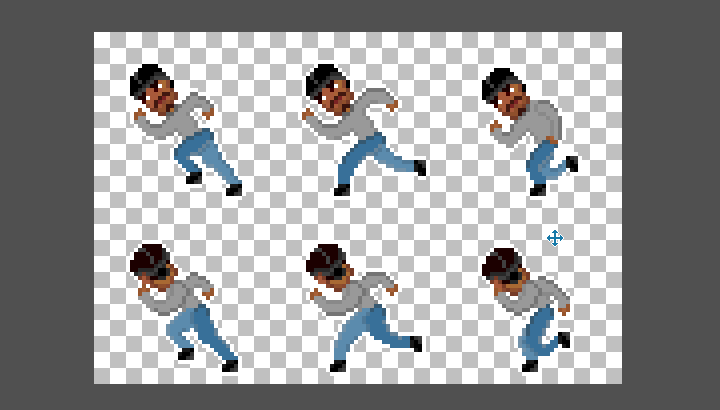
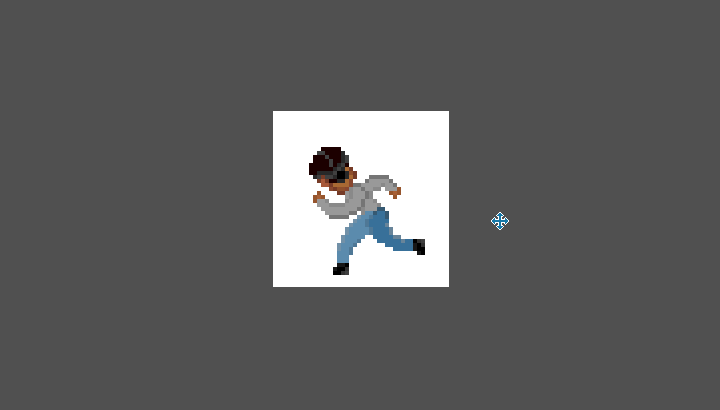

# Sizing and frame control

The [project](./project.md) canvas is a rectangle of certain pixel dimensions. Both the width and height of the canvas must be positive (`w,h > 0`).

Currently, the maximum dimensions for a *Stipple Effect* project are **1920 pixels wide** and **1080 pixels high**. This will likely increase in a future update.

This page describes the program actions that affect the sizing of the project canvas.

##  Resize

[*API function*](../api/project.md#resize)

**Shortcut:** <kbd>Ctrl</kbd> + <kbd>R</kbd>

Scales the project from its existing dimensions to its newly defined dimensions.

##  Pad canvas

[*API function*](../api/project.md#pad)

**Shortcut:** <kbd>Ctrl</kbd> + <kbd>Shift</kbd> + <kbd>R</kbd>

Pads each edge (left, right, top, bottom) of the canvas with a certain number of pixels. If a pad amount provided for an edge (also called an *edge delta*) is negative, the corresponding edge is cropped rather than padded. The canvas dimensions that result from the pad operation must be positive and less than or equal to the maximum dimensions permitted.

##  Split/stitch frames

**Shortcut:** <kbd>Ctrl</kbd> + <kbd>Shift</kbd> + <kbd>G</kbd>

The **split** and **stitch** operations allow users to seemlessly transition between [animations](./frame.md) and sprite sheets. This can be useful to quickly execute batch changes.

These operations are context-dependent: 
* If the project has multiple frames, it can be **stitched** into a sprite sheet.
* If it has a single frame i.e. is a sprite sheet, it can be **split** into an animation.

Frames are sequenced from the top-left corner of the sprite sheet, either vertically (top-to-bottom, left-to-right) or horizontally (left-to-right, top-to-bottom).

### Split a sprite sheet into frames

*API functions - [by columns and rows](../api/project.md#split), [by frame dimensions](../api/project.md#split_px)*

Splits the canvas of a project consisting of a single frame into sections that are sequenced as multiple frames.

The user can determine:

* whether to split the canvas into a number of columns and rows or by the dimensions of individual resultant frames
* whether to sequence the frames horizontally or vertically
* whether to pad remaining contents on each axis with additional frames or discard them

### Stitch an animation into a sprite sheet

[*API function*](../api/project.md#stitch)

Stitches the frames of the project together into a sprite sheet.

The user can configure how many frames are allocated to each axis of the sprite sheet, and whether to sequence the frames horizontally or vertically.

##  Crop canvas to selection bounds

**Shortcut:** <kbd>Ctrl</kbd> + <kbd>Shift</kbd> + <kbd>X</kbd>

Crops the project canvas to the smallest [axis-aligned bounding box](https://en.wikipedia.org/wiki/Minimum_bounding_box#Axis-aligned_minimum_bounding_box) that captures all the pixels in the [selection](./selection.md). This is essentially a [pad canvas](#pad-canvas) operation that pulls its edge deltas

---

**SEE ALSO**

* [Sizing shortcuts](./shortcuts.md#sizing)
* [Project](./project.md)
