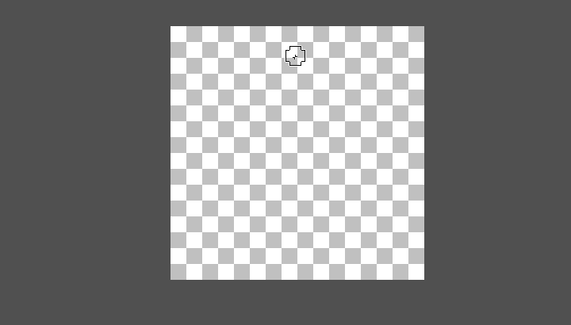

# State control

Most program actions in *Stipple Effect* constitute **edits**, and thus change the [project state](./project.md#state). It is important for users to be able to navigate between project states to revert to earlier or later states, in case of mistakes or simply for reference.

## State manager

Internally, *Stipple Effect* projects possess a structure called a state manager. The state manager maintains a [stack](https://en.wikipedia.org/wiki/Stack_(abstract_data_type)) of the project's states across operations.

The current state is defined by the **state pointer**, which points to one of the project states on the stack. The user can adjust the state pointer with undo and redo operations, or by manually selecting a project state from the project's history menu.

When an action/operation is performed (e.g. a tool is used), the state manager discards all project states on the stack above the state pointer, and pushes (adds) the project state that resulted from the operation onto the stack. The state pointer is incremented to point to the newly added state.

**Note:**

The program sometimes crashes due to an out of memory error caused by the accumulation of project states on the stack. This will be addressed in a future update.

## Undo & redo

###  Undo

**Shortcut:** <kbd>Ctrl</kbd> + <kbd>Z</kbd>

Decrement the state pointer to the previous state on the project state stack that is a checkpoint (not preceded and followed by a state triggered by the same operation).

###  Redo

**Shortcut:** <kbd>Ctrl</kbd> + <kbd>Y</kbd>

Increment the state pointer to the next state on the project state stack that is a checkpoint (not preceded and followed by a state triggered by the same operation).

### Granularity

There are variants of the undo and redo operations called **granular undo** and **granular redo**.

For operations that make a series of changes based on user input (e.g. brush stroke operations make changes as the user clicks and drags), users can use granular state change operations to iterate over incremental changes within the operation.

**Note:**

These non-checkpoint states that can only be accessed by the granular state change operations are dumped from the stack after 5 operations.

###  Granular undo

**Shortcut:** <kbd>Ctrl</kbd> + <kbd>Shift</kbd> + <kbd>Z</kbd>

Decrement the state pointer to the previous state on the project state stack.

###  Granular redo

**Shortcut:** <kbd>Ctrl</kbd> + <kbd>Shift</kbd> + <kbd>Y</kbd>

Increment the state pointer to the next state on the project state stack.

##  History

The **history menu** lists all of the project states on the stack. Users can preview states and revert back or jump forward to any of them.

**Note:**

Remember that reverting to a previous state and making changes will discard all successive states on the stack. *Stipple Effect* does **NOT** currently support non-linear history.

### Generate a time lapse

*Stipple Effect* has a built-in feature to generate time lapse animations from the first frame of each state comprising a concrete edit1 in a project's stack. 

This feature can be found in the `Actions` submenu of the navigation bar.

1 - A concrete edit is defined as something that affects pixel data, layer data, or frame data. [Editing the selection area](./sel-area-tools.md), for example, does not constitute a concrete edit.

---

**SEE ALSO**

* [Project state](./project.md#state)
* [State control shortcuts](./shortcuts.md#state-control)
