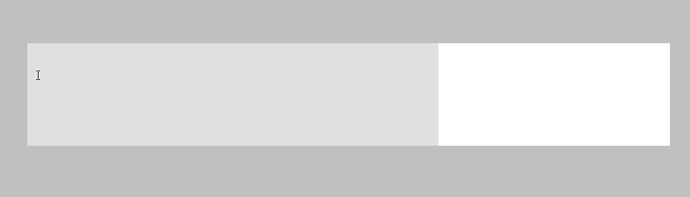

# Text Tool

[`< Tools`](./tools.md)

**Icon:** 

**Hotkey:** <kbd>T</kbd>

## Behaviour

The text tool is used to write text with pixel art fonts that comply with the [*Delta Time*](https://github.com/jbunke/delta-time) font specification. *Stipple Effect* system fonts are automatically loaded in. Further fonts can be uploaded and configured. There are tool options for setting the scale factor and alignment of the text to be written.

**Read more:**
* [Fonts](./fonts.md)

## Actions

* **Initialize typing mode:** ")
* **Increment/decrement font scale factor:** *Down/Up Arrow* or <kbd>Shift</kbd> + *Scroll Wheel*
* **Select previous/next font:** *Left/Right Arrow*
* **Cycle text alignment:** <kbd>Ctrl</kbd> + <kbd>K</kbd>
* **Upload new font:** <kbd>Shift</kbd> + <kbd>T</kbd>

### While typing

* **Edit text:** *< type as normal >*
* **Adjust text position:** <kbd>Shift</kbd> + *Arrow Keys*
* **Finish line:** 
* **Finish line and start new:** 
* **Finish line and start line below:** <kbd>Enter</kbd>
* **Cancel line:**  or <kbd>Esc</kbd>

## Tool Options

* **Text scale:** 1x - 10x
* **Text alignment:**
  * Left-aligned
  * Center-aligned
  * Right-aligned
* **Font**

## Special character sequences

*Stipple Effect* has a host of **special character sequences** that are replaced by corresponding characters when typed. Sequences begin with `[+`, followed by the character code, followed by `]`, with no spaces in between. For example, the full sequence needed to produce the character *Á* (uppercase A with acute accent) is `[+A/]`.

This is the full list of currently supported special characters:

| Code              | Special character | Description                       |
| :---------------: | :---------------: | :-------------------------------: |
| `A/` | Á | uppercase A with acute accent |
| `a/` | á | lowercase A with acute accent |
| `E/` | É | uppercase E with acute accent |
| `e/` | é | lowercase E with acute accent |
| `I/` | Í | uppercase I with acute accent |
| `i/` | í | lowercase I with acute accent |
| `O/` | Ó | uppercase O with acute accent |
| `o/` | ó | lowercase O with acute accent |
| `U/` | Ú | uppercase U with acute accent |
| `u/` | ú | lowercase U with acute accent |
| `N/` | Ń | uppercase N with acute accent |
| `n/` | ń | lowercase N with acute accent |
| `A\` | À | uppercase A with grave accent |
| `a\` | à | lowercase A with grave accent |
| `E\` | È | uppercase E with grave accent |
| `e\` | è | lowercase E with grave accent |
| `I\` | Ì | uppercase I with grave accent |
| `i\` | ì | lowercase I with grave accent |
| `O\` | Ò | uppercase O with grave accent |
| `o\` | ò | lowercase O with grave accent |
| `U\` | Ù | uppercase U with grave accent |
| `u\` | ù | lowercase U with grave accent |
| `N\` | Ǹ | uppercase N with grave accent |
| `n\` | ǹ | lowercase N with grave accent |
| `A~` | Ã | uppercase A with tilde |
| `a~` | ã | lowercase A with tilde |
| `O~` | Õ | uppercase O with tilde |
| `o~` | õ | lowercase O with tilde |
| `N~` | Ñ | uppercase N with tilde |
| `n~` | ñ | lowercase N with tilde |
| `A^` | Â | uppercase A with circumflex |
| `a^` | â | lowercase A with circumflex |
| `E^` | Ê | uppercase E with circumflex |
| `e^` | ê | lowercase E with circumflex |
| `I^` | Î | uppercase I with circumflex |
| `i^` | î | lowercase I with circumflex |
| `O^` | Ô | uppercase O with circumflex |
| `o^` | ô | lowercase O with circumflex |
| `U^` | Û | uppercase U with circumflex |
| `u^` | û | lowercase U with circumflex |
| `A:` | Ä | uppercase A with umlaut/diaeresis |
| `a:` | ä | lowercase A with umlaut/diaeresis |
| `E:` | Ë | uppercase E with diaeresis |
| `e:` | ë | lowercase E with diaeresis |
| `I:` | Ï | uppercase I with diaeresis |
| `i:` | ï | lowercase I with diaeresis |
| `O:` | Ö | uppercase O with umlaut/diaeresis |
| `o:` | ö | lowercase O with umlaut/diaeresis |
| `U:` | Ü | uppercase U with umlaut/diaeresis |
| `u:` | ü | lowercase U with umlaut/diaeresis |
| `ss` | ß | eszett |
| `AE` | Æ | uppercase ash |
| `ae` | æ | lowercase ash |
| `A0` | Å | uppercase A with overring |
| `a0` | å | lowercase A with overring |
| `O|` | Ø | uppercase O with stroke |
| `o|` | ø | lowercase O with stroke |
| `,C` | Ç | uppercase C with cedilla |
| `,c` | ç | lowercase C with cedilla |
| `,S` | Ş | uppercase S with cedilla |
| `,s` | ş | lowercase S with cedilla |
| `I.` | İ | uppercase dotted I |
| `i.` | ı | lowercase dotless I |
| `G(` | Ğ | uppercase G with breve |
| `g(` | ğ | lowercase G with breve |
| `.E` | Ẹ | uppercase E with subdot |
| `.e` | ẹ | lowercase E with subdot |
| `.E/` | Ẹ́ | uppercase E with subdot (high tone) |
| `.e/` | ẹ́ | lowercase E with subdot (high tone) |
| `.E\` | Ẹ̀ | uppercase E with subdot (low tone) |
| `.e\` | ẹ̀ | lowercase E with subdot (low tone) |
| `.O` | Ọ | uppercase O with subdot |
| `.o` | ọ | lowercase O with subdot |
| `.O/` | Ọ́ | uppercase O with subdot (high tone) |
| `.o/` | ọ́ | lowercase O with subdot (high tone) |
| `.O\` | Ọ̀ | uppercase O with subdot (low tone) |
| `.o\` | ọ̀ | lowercase O with subdot (low tone) |
| `.S` | Ṣ | uppercase S with subdot |
| `.s` | ṣ | lowercase S with subdot |

With the use of special character sequences, *Stipple Effect* supports the standard orthographies of the following languages:
* Afrikaans
* Albanian
* Catalan
* Danish
* Dutch
* English
* Finnish
* French
* Italian
* German
* Norwegian (Bokmål & Nynorsk)
* Portuguese
* Spanish (Castilian)
* Swahili
* Swedish
* Turkish
* Xhosa
* Yorùbá
* Zulu
* \+ more

Future updates will aim extend the special character set to support:
* Czech
* Estonian
* Hausa, Igbo (Pan-Nigerian alphabet)
* Polish
* Serbo-Croatian (Latin alphabet)
* Slovak
* Slovene
* Vietnamese
* \+ more
